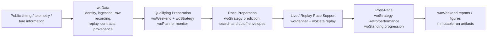

# woWeekend

`woWeekend` turns the separate dr-wo packages into a repeatable Formula 1
race-weekend workflow: qualifying preparation, race preparation, live/replay
support and post-race review. It owns orchestration and portable reports while
leaving numerical methods and data contracts with their source packages.

All inputs are public F1 timing, telemetry and tyre information.

## End-to-end workflow



Ownership stays explicit: `woData` is the reproducible data and artifact layer;
`woStrategy` owns performance, tyre and strategy calculations; `woPlanner` owns
interactive qualifying/race support; `woStanding` owns championship analysis;
`woWeekend` coordinates those capabilities without duplicating them.

## Canonical weekend example: 2026-R13

[Browse the compact 2026-R13 example](examples/2026-R13/) for the exact
Race Preparation and historical Post-Race outputs selected from immutable local
runs, including assumptions, strategy rows, degradation cutoffs, live-MC history,
Retro comparison and known limitations.

<p>
  
  
</p>

The Race Preparation example completed successfully. The Post-Race example is
historical replay validation and is intentionally marked `PARTIAL`: every
implemented component succeeded, while Event-Aware Hindsight Optimum remains
unavailable because the deterministic SC/VSC counterfactual API has not yet
been extracted from `woPlanner`.

## Operator interface

The three preparation/review stages are independently invokable. Numerical
analysis remains in `woStrategy`, data paths and immutable run storage remain in
`woData`, standings remain in `woStanding`, and GUI/manual controls remain in
`woPlanner`.

```bash
woweekend-quali --event 2026-07 --config qualifying.json
woweekend-race --event 2026-07 --config race.json
woweekend-post --event 2026-07 --config post_race.json
```

Generate or validate self-documenting configuration:

```bash
woweekend-race --generate-config race.json
woweekend-race --validate-config race.json
```

The repository also keeps current operator configs under `configs/`. The
current race config is a 53-lap setup with a 23-second green-state pit loss and
no manual tyre-model overrides, so the cached pre-race tyre prediction remains
the source of compound performance and degradation values.
The checked-in qualifying config uses a 5% push-lap threshold.

Regenerate presentation artifacts without rerunning deterministic analysis:

```bash
woweekend-race --event 2026-07 --report-only RUN_ID --language en-GB
```

Post-Race reconstructs the historical live tyre-MC sequence before presenting
the separate full-race Retro MC result. It first merges complete local live
recording fragments, then reuses or downloads the canonical archive replay when
the recovered record lacks race distance or tyre metadata. Every leader-lap
cut is passed to woPlanner's existing live recalculation service; Post does not
contain another MC implementation.

Race Preparation now ensures woPlanner's event-specific live-MC
`model_config.json` exists by reusing woStrategy's canonical pre-race producer.
Post repeats that inexpensive validation and automatically generates a missing
or stale historical prerequisite before replay. Operators do not need to run
`wostrategy.script.pre_race_analysis` separately. The manifest records whether
the config was `reused` or `generated`; a genuine generation failure is isolated
to live-MC history in Post.

```json
{
  "live_replay": {
    "mode": "algorithm_only"
  }
}
```

`algorithm_only` ignores recorded manual overrides. `operational` preserves the
calculated MC coordinates and separately reconstructs recorded manual and
effective values. The compact `live_mc_history.json` artifact and two English
evolution figures are included in the report bundle when replay succeeds;
replay failure does not stop other Post components.

The validation, legacy compatibility boundary, and deliberate freshness/runtime
compromises are documented in
[docs/LIVE_MC_MODEL_CONFIG_PREREQUISITE.md](docs/LIVE_MC_MODEL_CONFIG_PREREQUISITE.md).

Pit loss can be supplied as one whole value; no S3/S1 split is required:

```json
{
  "pit_loss": {
    "green": {"total": 20.5},
    "sc_vsc": {"total": 11.3}
  }
}
```

For either state, use `total` or the `pit_in_s3` + `pit_out_s1` pair, never both.

## Degradation cutoff scan

Race Preparation keeps MEDIUM as the degradation scan variable, preserves the
predicted S:M:H degradation ratios, and holds compound performance deltas fixed.
It generates both unrestricted and rules-compliant fixed-stop envelopes.

With `degradation_cutoff.scan_min: null`, the normal prediction-centred scan is
run first. If it does not bracket a positive 1→2 cutoff, the lower bound is
progressively extended toward zero. The search stops when it finds a bracket or
reaches zero, and never evaluates negative degradation. A numeric `scan_min` is
a hard user boundary and disables extension below that value.

Artifacts record the predicted MEDIUM degradation, initial and effective lower
bounds, cutoff values, and a 1→2 search status. A search that reaches zero
without a positive crossing reports `no_positive_degradation_crossing`; it does
not describe the result merely as outside the initial range. Cutoff figures
label the prediction and each available 1→2 and 2→3 cutoff.

When persisted FP evidence contains a usable MEDIUM degradation coordinate, the
same figures add visibly distinct `FP1 diagnostic`, `FP2 diagnostic` and `FP3
diagnostic` reference lines. These do not alter the envelope or constitute an FP
strategy: absolute degradation remains confounded with fuel/load in the current
practice model, while compound performance is not independently identifiable.
The marker values and limitations are also stored in cutoff/report JSON.

Assumptions and compatibility choices:

- the existing exact optimiser and crossing refinement define each cutoff;
- the automatic extension applies only to 1→2, while existing 2→3 scan logic
  and non-monotonic warnings are preserved;
- zero may be evaluated as the terminal boundary, but a crossing exactly at zero
  is not considered a positive-degradation cutoff;
- the tyre prediction model is consumed unchanged.

Current compromises and follow-up work are documented in
`woStrategy/doc/DEGRADATION_CUTOFF.md`. In particular, extension uses
deterministic bound halving, status values remain strings for artifact
compatibility, and any future 2→3 extension should be designed separately.

Runs are stored beneath
`<WODATA_ROOT>/woweekend/runs/schema_v1/event=<event>/workflow=<workflow>/runs/<run_id>`.
Each run keeps input/resolved configs, small deterministic outputs, a manifest,
and a ChatGPT-ready bundle of at most 20 files. Heavy reusable caches are stored
as exact references with provenance and are never silently replaced by `latest`.

See [AUDIT.md](AUDIT.md) for the audit-first reuse map and known extraction gap
for the Event-Aware Hindsight Optimum.

Future maintainers and AI development agents should start with
[docs/AI_DEVELOPMENT_GUIDE.md](docs/AI_DEVELOPMENT_GUIDE.md). It describes the
repository boundaries, workflow/data flow, deterministic artifacts, test
strategy, and the assumptions and compromises behind the current design.

This project is developed extensively with coding agents. The guide is durable
engineering context, not hidden implementation history.
