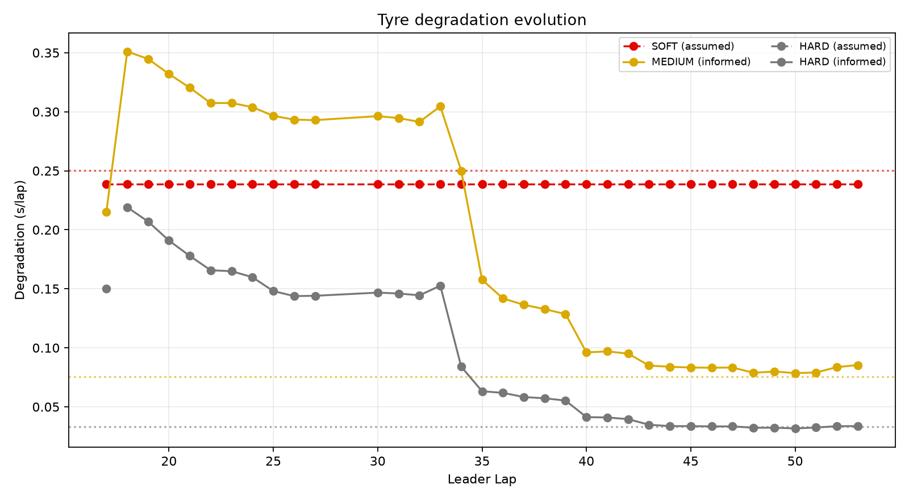
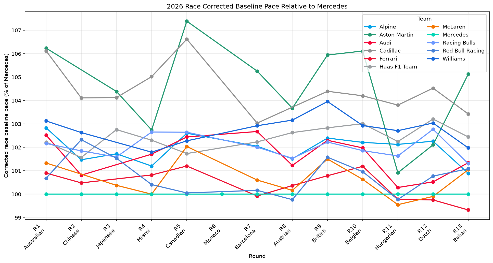

# 2026-R13 weekend example

This is a compact, commit-friendly view of the Italian Grand Prix workflow using
real public 2026-R13 data. The files were selected without modifying numerical
results from these immutable `woData` runs:

- Race Preparation: `20260908T210451.341404Z-347bfbf4c7` (`SUCCESS`)
- Post-Race: `20260908T215427.626629Z-dfe089c9e0` (`PARTIAL`)

For portability, machine-specific source prefixes in the selected JSON copies
are represented as `<WODATA_ROOT>`; numerical values and workflow statuses are
unchanged.

The command-line event identifier is `2026-13` (canonical `YYYY-RR` form):

```bash
woweekend-quali --event 2026-13 --config configs/qualifying.json
woweekend-race --event 2026-13 --config configs/race.json
woweekend-post --event 2026-13 --config configs/post_race.json
```

## Race Preparation


The selected artifacts show the effective cross-event tyre prediction, the top
rules-compliant exact-search rows, and the fixed-stop envelope/cutoff scan:

- [`race-preparation/tyre_prediction.effective.json`](race-preparation/tyre_prediction.effective.json)
- [`race-preparation/strategy_rules_compliant.json`](race-preparation/strategy_rules_compliant.json)
- [`race-preparation/cutoff_rules_compliant.json`](race-preparation/cutoff_rules_compliant.json)
- [`race-preparation/manifest.json`](race-preparation/manifest.json)

The prediction was trained through R12 and mapped to the R13 Pirelli allocation.
Current-weekend FP coordinates are diagnostic markers; they do not silently
replace the production tyre input. Strategy cost is conditional on the configured
53-lap distance and pit-loss/tyre assumptions.

The commit-portable writing-agent input is in
[`report-inputs/race-preparation/`](report-inputs/race-preparation/). Start with
its [`REPORT_DRAFT.md`](report-inputs/race-preparation/REPORT_DRAFT.md), then
send the complete directory so its source JSON and selected figures remain
available for verification.

The corresponding report is
[`2026_Italian_GP_PreRace_Strategy_Report_FP_Markers_en-GB.md`](reports/race-preparation/2026_Italian_GP_PreRace_Strategy_Report_FP_Markers_en-GB.md),
with its selected images colocated under `reports/race-preparation/figures/`.

## Historical replay and Post-Race

<p>
  
  
</p>

This is historical replay validation, not a claim that the application was
making these decisions for a team in real time. `live_mc_history.json` rebuilds
the causal leader-lap update sequence from the canonical recording in
`algorithm_only` mode; the full-race Retro estimate is calculated separately.
In the corrected replay, SOFT is never presented as directly observed: it stays
derived from the directly informed MEDIUM value using the implemented compound
relationship. HARD becomes direct only after supporting race evidence arrives.

- [`post-race/live_mc_history.json`](post-race/live_mc_history.json)
- [`post-race/retro_green_optimum.json`](post-race/retro_green_optimum.json)
- [`post-race/tyre_comparison.json`](post-race/tyre_comparison.json)
- [`post-race/manifest.json`](post-race/manifest.json)

Every currently implemented Post-Race component succeeded. The run is `PARTIAL`
only because Event-Aware Hindsight Optimum is explicitly unavailable: its
deterministic SC/VSC counterfactual API has not yet been extracted from
`woPlanner`. `Retro Green Optimum` therefore uses the green-race optimiser and
does not model the actual event timeline.

The commit-portable writing-agent input is in
[`report-inputs/post-race/`](report-inputs/post-race/). Start with its
[`REPORT_DRAFT.md`](report-inputs/post-race/REPORT_DRAFT.md), then send the
complete directory. The included R13 performance tracker is supporting context,
not a recommended public-facing hero figure.

The corresponding report is
[`2026_R13_Italian_GP_Post_Race_Report_en-GB.md`](reports/post-race/2026_R13_Italian_GP_Post_Race_Report_en-GB.md),
with its selected images colocated under `reports/post-race/figures/`.
