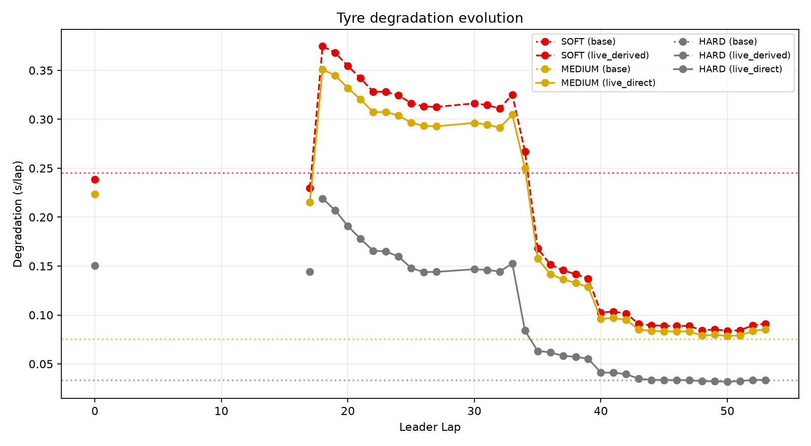
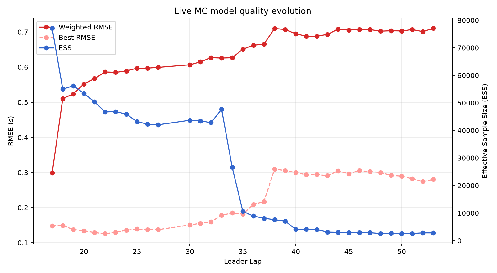
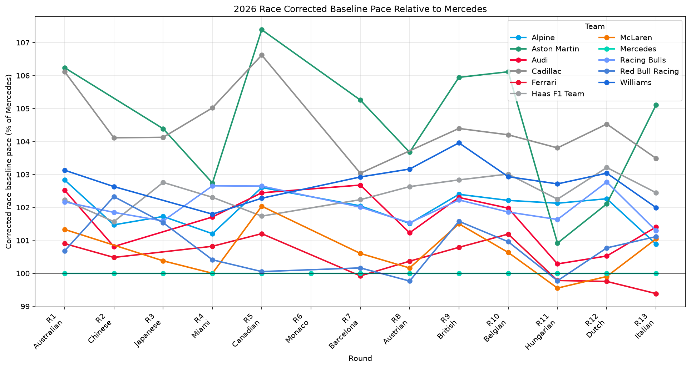

# 2026 R13 Italian Grand Prix Post-Race Engineering Review

**Event:** 2026 Italian Grand Prix 
**Location:** Monza 
**Race distance:** 53 laps 
**Workflow:** Post-Race Review 
**Run ID:** `20260908T215427.626629Z-dfe089c9e0` 
**Run status:** `PARTIAL`

> `PARTIAL` is caused solely by `Event-Aware Hindsight Optimum` being `UNAVAILABLE`. All other currently implemented outputs in this workflow completed successfully. Numerical JSON artifacts are authoritative; figures are used for interpretation and presentation only.

---

## 1. Executive summary

The main post-race findings come from the historical causal live replay, the full-race Retro MC, the Green Optimum calculation, and the R13 race performance tracker.

1. **The Live MC first gained sufficient clean-lap support at leader lap 17.** 
   At that point, MEDIUM was directly informed at **0.215040 s/lap**; HARD was still `live_derived` from MEDIUM at **0.144507 s/lap**; and SOFT was also `live_derived` at **0.229549 s/lap**. HARD became `live_direct` from leader lap 18.

2. **By the end of the race, the live model had moved to much lower MEDIUM and HARD degradation than the pre-race baseline.** 
   At leader lap 53, HARD was directly informed at **0.033666 s/lap**, MEDIUM at **0.085392 s/lap**, while SOFT remained derived at **0.091153 s/lap**. SOFT was never directly observed in the replay and retained the implemented pre-race SOFT:MEDIUM degradation ratio of **1.067471**.

3. **The full-race Retro estimate is separate from the live replay.** 
   Final Retro degradation estimates are HARD **0.033241 s/lap**, MEDIUM **0.075392 s/lap**, and SOFT **0.245204 s/lap**. These are model estimates using the complete race, not ground truth and not information that would have been available live.

4. **Curve stability does not imply strong physical identifiability.** 
   The final live model uses **196 clean race laps across 23 runs**, but ESS is only **2802.05**, or **0.0350** of 80,000 samples. Final weighted RMSE is **0.710560 s**. Fuel and track corrections remain aliased; only the combination `track_rate - fuel_rate` is identifiable.

5. **The green-race counterfactual produces a tie between two one-stop strategies.** 
   `H-(35)M` and `M-(18)H` both have model cost **72.245301**. This calculation uses the empirical green pit loss of **30.28125 s** and does **not** use the actual SC/VSC event timeline.

6. **The R13 race performance tracker is supporting diagnostic context only.** 
   For R13, the model places Ferrari at **99.386% of Mercedes pace (-0.509 s)**, Alpine at **100.888% (+0.740 s)**, McLaren at **101.044% (+0.868 s)**, and Red Bull Racing at **101.114% (+0.929 s)**. These are model outputs, not a claim of the true competitive order.

---

## 2. Data flow and provenance

The tyre-estimation flow is explicitly separated into three stages:

`Pre-race prediction → Historical live MC evolution → Final full-race Retro MC`

Key provenance points:

- the pre-race `model_config` was judged **valid and fresh** and was reused rather than recomputed;
- the configuration was produced from FP1, FP2 and FP3;
- live replay mode is `algorithm_only`;
- the replay uses a `leader_lap_completion_clock_cut`;
- the full-race cache was not used as per-lap live input;
- replay coverage is complete through leader lap **53/53**;
- the source is the recorded live-timing stream;
- full-race Retro is explicitly separate from the historical live replay.

This allows three distinct questions to be addressed without mixing their evidential status:

- what the model believed pre-race;
- how it would have evolved causally during the race;
- how the full race is interpreted retrospectively.

---

## 3. Live MC tyre degradation evolution

**Figure interpretation**

- solid line: `live_direct`;
- dashed line: `live_derived`;
- dotted horizontal line: pre-race baseline;
- SOFT remains derived throughout the replay.

### 3.1 First supported update: leader lap 17

Leader laps 1–16 did not contain enough eligible clean-lap evidence to trigger an update. At leader lap 17, the replay first reached **8 eligible clean laps**.

| Compound | Lap 17 degradation | Source | Interpretation |
|---|---:|---|---|
| SOFT | 0.229549 s/lap | `live_derived` | Derived from MEDIUM |
| MEDIUM | 0.215040 s/lap | `live_direct` | Directly supported |
| HARD | 0.144507 s/lap | `live_derived` | Still derived from MEDIUM |

At leader lap 18, HARD becomes `live_direct`. From that point onward, MEDIUM and HARD are driven directly by race evidence, while SOFT remains derived.

### 3.2 Evolution through the race

Selected points from the causal replay:

| Leader lap | Clean laps | MEDIUM | HARD | SOFT |
|---:|---:|---:|---:|---:|
| 17 | 8 | 0.215040 | 0.144507* | 0.229549* |
| 18 | 17 | 0.350988 | 0.219112 | 0.374669* |
| 35 | 74 | 0.157606 | 0.063213 | 0.168240* |
| 53 | 196 | 0.085392 | 0.033666 | 0.091153* |

\* `live_derived`, not directly observed for that compound.

The sharp changes around the early supported updates, and again later in the race, should be interpreted as posterior movement as the available clean-lap structure changes. They should not be read literally as physical tyre degradation changing discontinuously from lap to lap.

### 3.3 SOFT limitation

The final SOFT live value of **0.091153 s/lap** is not an independently measured race estimate. It remains derived from MEDIUM through the implemented pre-race relationship:

`SOFT / MEDIUM degradation ratio = 1.067471`

The directly supported live conclusions for this race are therefore primarily the MEDIUM and HARD degradation trends.

---

## 4. Live MC model quality

As the replay accumulates race evidence, ESS falls while weighted RMSE rises.

| Leader lap | Clean laps | Runs | ESS | ESS fraction | Best RMSE | Weighted RMSE |
|---:|---:|---:|---:|---:|---:|---:|
| 17 | 8 | 2 | 77064.06 | 0.9633 | 0.148423 s | 0.298851 s |
| 35 | 74 | 11 | 10623.44 | 0.1328 | 0.181631 s | 0.650924 s |
| 53 | 196 | 23 | 2802.05 | 0.0350 | 0.280574 s | 0.710560 s |

The final numerical status is still `adequate`, but this does not imply that posterior support is strong.

Important qualifications:

- only about **3.5%** of the nominal 80,000 samples remain as effective sample size;
- weighted RMSE is materially worse than best RMSE;
- fuel and track corrections remain locally non-identifiable;
- `fuel_track_alias = true`;
- the identifiable combination is `track_rate - fuel_rate`, not the two terms independently.

For this reason, the apparent late-race stability of Figure 1 should always be read together with ESS and RMSE.

---

## 5. Pre-race prediction vs full-race Retro

The full-race Retro result is a retrospective estimate using the complete race. It is **not ground truth** and must not be used to imply that the live model should have known the same values earlier.

### 5.1 Degradation

| Compound | Pre-race | Full-race Retro | Prediction − Retro |
|---|---:|---:|---:|
| SOFT | 0.238814 | 0.245204 | −0.006390 |
| MEDIUM | 0.223719 | 0.075392 | +0.148328 |
| HARD | 0.150340 | 0.033241 | +0.117099 |

The clearest mismatch is on MEDIUM and HARD, where the pre-race model was substantially higher than the full-race Retro estimate.

SOFT has a similar central value pre-race and in Retro, but its Retro degradation uncertainty is **0.159650 s/lap**, so the central-value agreement should not be over-interpreted.

### 5.2 Performance delta to MEDIUM

| Compound | Pre-race | Full-race Retro | Prediction − Retro |
|---|---:|---:|---:|
| SOFT | −0.319645 s | −0.413818 s | +0.094173 s |
| MEDIUM | 0.000000 s | 0.000000 s | 0.000000 s |
| HARD | +0.333745 s | +0.232291 s | +0.101454 s |

Retro performance uncertainty is **0.471614 s** for SOFT and **0.355624 s** for MEDIUM. These performance deltas should therefore also be treated as uncertain model estimates rather than exact constants.

---

## 6. Retro Green Optimum

This module answers a deliberately restricted question:

> Under an all-green counterfactual, using the Retro tyre model and the empirical green pit loss, which strategy minimises model cost?

It does **not** use the actual race SC/VSC timeline.

### 6.1 Best strategies

| Rank | Strategy | Model cost | Delta to best |
|---:|---|---:|---:|
| 1 | `H-(35)M` | 72.245301 | 0.000000 |
| 2 | `M-(18)H` | 72.245301 | 0.000000 |
| 3 | `H-(45)S` | 80.655725 | +8.410424 |
| 4 | `S-(8)H` | 80.655725 | +8.410424 |

The model gives `H-(35)M` and `M-(18)H` exactly the same green-race cost. This result alone therefore does not distinguish which direction of the one-stop is preferable.

The best two-stop group is at least **18.381014** model-cost units behind the optimum under the same assumptions.

### 6.2 What this result does not answer

It does not:

- represent the optimum under the actual event timeline;
- incorporate the timing of real SC/VSC periods;
- substitute for Event-Aware Hindsight Optimum;
- convert directly into an observed race-time delta.

`Event-Aware Hindsight Optimum` remains explicitly `UNAVAILABLE` because a deterministic SC/VSC counterfactual API has not yet been extracted from `woPlanner`.

---

## 7. Empirical pit loss

| Condition | Reported total | Pit-in S3 median | Pit-out S1 median | Samples |
|---|---:|---:|---:|---:|
| GREEN | 30.28125 s | 5.2705 s | 25.01075 s | 2 |
| SC/VSC | 37.2315 s | 12.6865 s | 28.554 s | 7 |

Two limitations must be retained:

1. **Support is very small and uneven.** 
   GREEN has only 2 samples; SC/VSC has 7.

2. The reported `total` is the authoritative artifact value. 
   This report does **not** recompute a replacement total from the two component medians.

The fact that the reported SC/VSC total is higher than the GREEN total must not be generalised into a claim that pitting under SC/VSC is intrinsically more expensive. The result is better treated as a sample/context limitation for this race.

---

## 8. R13 race performance tracker: supporting context

The tracker uses Mercedes = 100% as the reference.

Selected R13 outputs:

| Team | % of Mercedes | Relative to Mercedes |
|---|---:|---:|
| Ferrari | 99.386% | −0.509 s |
| Mercedes | 100.000% | 0.000 s |
| Alpine | 100.888% | +0.740 s |
| McLaren | 101.044% | +0.868 s |
| Red Bull Racing | 101.114% | +0.929 s |
| Racing Bulls | 101.293% | +1.075 s |
| Audi | 101.405% | +1.169 s |

This figure is included only as supporting internal context. It should not be used as the public-facing hero figure, and the R13 Ferrari result in particular should be treated as a model-diagnostic output rather than asserted as the true competitive order.

The validated public `woStrategy` season tracker remains the R1–R12 version.

---

## 9. Engineering interpretation

The post-race workflow now separates three distinct questions cleanly:

- **Was the pre-race tyre model reasonable?** 
  MEDIUM and HARD degradation were materially over-predicted relative to the full-race Retro estimate.

- **When did enough evidence become available to update the model live?** 
  MEDIUM became directly supported at leader lap 17; HARD at leader lap 18; both then moved steadily lower as more clean-lap evidence accumulated.

- **What does the full race imply retrospectively?** 
  Retro favours substantially lower MEDIUM/HARD degradation and, under a purely green counterfactual, a one-stop structure.

Three methodological cautions should remain explicit in future reports:

1. **Derived compound is not observed compound.** 
   SOFT never receives direct race support in this replay.

2. **Posterior stability is not physical identifiability.** 
   ESS, RMSE and fuel-track alias must be shown alongside the point estimates.

3. **Green optimum is not event-aware optimum.** 
   Until deterministic SC/VSC counterfactual support exists, the green-race result must not be presented as the actual hindsight strategy.

---

## 10. Component status

### Successful outputs

- Empirical Pit Loss: `SUCCESS`
- Live MC History: `SUCCESS`
- Pit Loss Resolution: `SUCCESS`
- Pre-race Artifacts: `SUCCESS`
- Qualifying Performance: `SUCCESS`
- Race Performance: `SUCCESS`
- Race Performance Tracker: `SUCCESS`
- Retro Green Optimum: `SUCCESS`
- Retro Tyre Estimate: `SUCCESS`
- Tyre Comparison: `SUCCESS`
- Standings: `SUCCESS`

### Unavailable output

- Event-Aware Hindsight Optimum: `UNAVAILABLE`

**Reason:** a deterministic SC/VSC counterfactual API has not yet been extracted from `woPlanner`.

**Reporting rule:** do not substitute the Green Optimum and do not infer a replacement value manually.

---

## Appendix A. Key artifacts

- `manifest.json` — run identity, component status and provenance
- `event.metadata.json` — event context and race distance
- `config.resolved.json` — resolved workflow configuration
- `analysis_results.json` — complete workflow result payload
- `report_context.json` — report-facing context and warnings
- `live_mc_history.json` — causal live update history, source labels, support, ESS and RMSE
- `retro_tyre_estimate.json` — full-race Retro tyre estimate
- `tyre_comparison.json` — pre-race vs Retro comparison
- `retro_green_optimum.json` — green-race counterfactual strategy search
- `empirical_pit_loss.json` — empirical pit-loss medians and sample counts
- `race_performance_tracker.json` — R1–R13 supporting performance context

---

*Generated from immutable Post-Race run `20260908T215427.626629Z-dfe089c9e0`. Numerical JSON artifacts are authoritative; figures are for interpretation and presentation only.*
