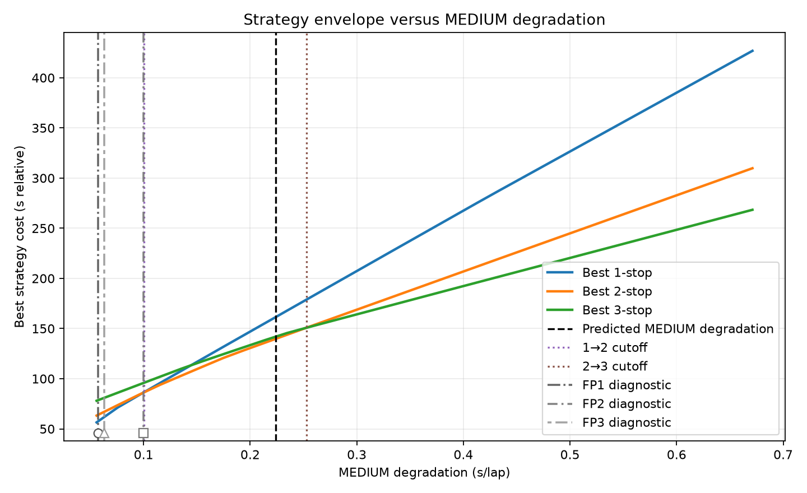
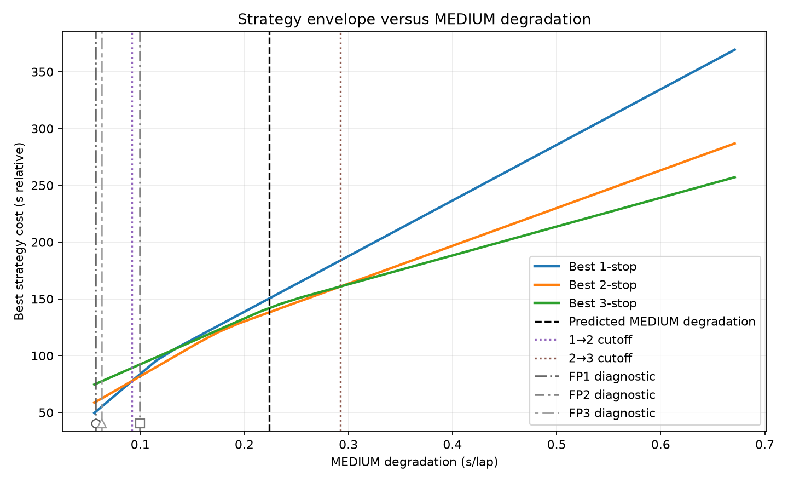

# 2026 Italian Grand Prix — Pre-Race Strategy Engineering Report

**Event:** 2026-13 — Italian Grand Prix 
**Session:** Race 
**Workflow:** `race_preparation` 
**Template:** Engineering 
**Language:** en-GB 
**Race distance:** 53 laps 
**Strategy treatment:** central values only 
**Tyre uncertainty:** retained where supplied 

---

## 1. Executive summary

The production strategy calculation uses the **Historical Race-Retro cross-event P0/D0 prediction (default)**, trained through Round 12 and mapped to the Pirelli-announced C3/C4/C5 allocation for Monza. There is no manual tyre override in this run, and current-weekend FP1–FP3 evidence **does not modify the production tyre inputs**.

The production MEDIUM degradation is **0.223719 s/lap**. Against the supplied deterministic stop-count envelopes:

| Optimisation | 1→2 cutoff | 2→3 cutoff | Production regime |
|---|---:|---:|---|
| Unrestricted | **0.092211 s/lap** | **0.292532 s/lap** | **2-stop** |
| Supplied rules-compliant | **0.100273 s/lap** | **0.252840 s/lap** | **2-stop** |

The supplied rules-compliant search therefore selects a **2-stop baseline**. Its first three exact-search rows tie at **139.674416 s relative**:

- **H-(19)H-38(S)**
- **H-(19)S-34(H)**
- **S-(15)H-34(H)**

The leading supplied rules-compliant 3-stop row, **H-(16)S-28(S)-40(S)**, is **+2.271896 s** behind the best 2-stop result in this deterministic model.

The new FP overlays add useful diagnostic context. The MEDIUM posterior coordinates are **0.057554 s/lap (FP1)**, **0.099784 s/lap (FP2)** and **0.063075 s/lap (FP3)**. These values are shown against the unchanged production cutoff envelope, but they are **diagnostic coordinates only**: absolute degradation is not structurally separable from fuel/load effects in the current practice-session model, and the FP markers do not replace the production tyre inputs.

---

## 2. Tyre inputs used for strategy

### 2.1 Effective production values

The effective tyre values used by the strategy calculation are identical to the automatic P0/D0 baseline because no manual fallback override was applied.

| Compound | Absolute compound | Performance vs MEDIUM | Degradation | Exact source family | Prediction-domain status |
|---|---|---:|---:|---|---|
| HARD | C3 | **+0.333745 s** | **0.150340 s/lap** | **Historical Race-Retro cross-event P0/D0 prediction (default)** | `inside_observed_descriptor_domain` |
| MEDIUM | C4 | **0.000000 s** | **0.223719 s/lap** | **Historical Race-Retro cross-event P0/D0 prediction (default)** | `inside_observed_descriptor_domain` |
| SOFT | C5 | **−0.319645 s** | **0.238814 s/lap** | **Historical Race-Retro cross-event P0/D0 prediction (default)** | `inside_observed_descriptor_domain` |

The human-facing source statement supplied by the artefact is:

> Historical Race-Retro cross-event P0/D0 prediction (default), mapped to the Pirelli-announced compound allocation; current-weekend FP does not modify the production input.

The production ordering is therefore:

- **Performance:** SOFT > MEDIUM > HARD.
- **Degradation:** HARD < MEDIUM < SOFT.

The HARD has the largest initial performance penalty relative to MEDIUM but the lowest production degradation, which is why the exact-search optimum is HARD-heavy.

### 2.2 Race distance and pit loss

- Race distance: **53 laps**.
- Race-distance source used by the workflow: **manual override** via `race.total_laps`.
- Green pit loss: **23.0 s**.
- SC/VSC pit loss: **8.9 s**.

These are deterministic optimiser inputs. They are not, by themselves, forecasts of the realised race cost of a stop.

---

## 3. Practice evidence

### 3.1 Status, freshness and role

The FP tyre-evidence artefact was calculated at **2026-09-05 21:49:20 UTC**, later than the production tyre prediction at **2026-09-05 21:40:19 UTC**.

The supplied freshness warning is:

> **FP evidence is newer than the production tyre prediction; FP remains diagnostic-only.**

The workflow also states:

- `report_status = diagnostic_only`
- `production_strategy_inputs_modified = false`
- source family = `fp_diagnostic`

The FP data therefore provide diagnostic evidence only; they do **not** update the production P0/D0 strategy inputs in this run.

### 3.2 Structural-identifiability caveats

The practice evidence explicitly preserves three confounding statements:

1. Absolute fuel and the common absolute degradation level are structurally confounded.
2. A reported posterior coordinate is not automatically a physically identifiable measurement.
3. Non-reference compound performance is absorbed by free single-compound run intercepts.

Accordingly, the degradation values below are **posterior coordinates**, not direct measurements of absolute physical tyre degradation.

### 3.3 MEDIUM diagnostic markers shown on the cutoff figures

| Session | MEDIUM coordinate | P10–P90 | Support | Structural-identifiability label | Production input? |
|---|---:|---:|---|---|---|
| FP1 | **0.057554 s/lap** | 0.023899–0.099622 | 44 laps / 8 runs | `absolute_not_identifiable; combined_slope_or_contrasts_only` | No |
| FP2 | **0.099784 s/lap** | 0.040045–0.167082 | 57 laps / 10 runs | `absolute_not_identifiable; combined_slope_or_contrasts_only` | No |
| FP3 | **0.063075 s/lap** | 0.020615–0.139566 | 8 laps / 2 runs | `absolute_not_identifiable; combined_slope_or_contrasts_only` | No |

These markers are positioned against the **unchanged production strategy envelope**. Their purpose is to show where the session-level FP coordinates sit relative to the production cutoffs; they must not be read as alternative production tyre inputs.

### 3.4 Full FP1 evidence

Support: **44 usable laps / 8 usable runs**.

| Quantity | Median | P10–P90 | Structural-identifiability label |
|---|---:|---:|---|
| HARD degradation | 0.007586 s/lap | 0.001032–0.031929 | `absolute_not_identifiable; combined_slope_or_contrasts_only` |
| MEDIUM degradation | 0.057554 s/lap | 0.023899–0.099622 | `absolute_not_identifiable; combined_slope_or_contrasts_only` |
| SOFT degradation | 0.134365 s/lap | 0.068098–0.190522 | `absolute_not_identifiable; combined_slope_or_contrasts_only` |
| HARD compound delta | +0.492185 s | +0.053426–+0.826219 | `not_identifiable_with_free_single_compound_run_intercepts` |
| SOFT compound delta | −0.490879 s | −0.925472–−0.098126 | `not_identifiable_with_free_single_compound_run_intercepts` |
| Fuel rate | 0.008233 s/lap | 0.001256–0.026845 | `not_identifiable_separately_from_absolute_degradation` |
| Track rate | −0.046600 s/lap | −0.049671–−0.041227 | `conditionally_identifiable_in_current_model` |

### 3.5 Full FP2 evidence

Support: **57 usable laps / 10 usable runs**.

| Quantity | Median | P10–P90 | Structural-identifiability label |
|---|---:|---:|---|
| HARD degradation | 0.020175 s/lap | 0.003446–0.058611 | `absolute_not_identifiable; combined_slope_or_contrasts_only` |
| MEDIUM degradation | 0.099784 s/lap | 0.040045–0.167082 | `absolute_not_identifiable; combined_slope_or_contrasts_only` |
| SOFT degradation | 0.170297 s/lap | 0.120012–0.195154 | `absolute_not_identifiable; combined_slope_or_contrasts_only` |
| HARD compound delta | +0.502250 s | +0.097297–+0.897111 | `not_identifiable_with_free_single_compound_run_intercepts` |
| SOFT compound delta | −0.490310 s | −0.894863–−0.096977 | `not_identifiable_with_free_single_compound_run_intercepts` |
| Fuel rate | 0.020380 s/lap | 0.003581–0.054291 | `not_identifiable_separately_from_absolute_degradation` |
| Track rate | −0.035842 s/lap | −0.047052–−0.019996 | `conditionally_identifiable_in_current_model` |

### 3.6 Full FP3 evidence

Support: **8 usable laps / 2 usable runs**.

| Quantity | Median | P10–P90 | Structural-identifiability label |
|---|---:|---:|---|
| HARD degradation | 0.029933 s/lap | 0.004379–0.096138 | `absolute_not_identifiable; combined_slope_or_contrasts_only` |
| MEDIUM degradation | 0.063075 s/lap | 0.020615–0.139566 | `absolute_not_identifiable; combined_slope_or_contrasts_only` |
| SOFT degradation | 0.106091 s/lap | 0.044173–0.177417 | `absolute_not_identifiable; combined_slope_or_contrasts_only` |
| HARD compound delta | +0.485912 s | +0.094832–+0.905221 | `not_identifiable_with_free_single_compound_run_intercepts` |
| SOFT compound delta | −0.500811 s | −0.907512–−0.097102 | `not_identifiable_with_free_single_compound_run_intercepts` |
| Fuel rate | 0.018999 s/lap | 0.003072–0.056308 | `not_identifiable_separately_from_absolute_degradation` |
| Track rate | −0.031711 s/lap | −0.047123–+0.006537 | `conditionally_identifiable_in_current_model` |

FP3 has materially weaker support than FP1 and FP2, with only **2 usable runs**.

### 3.7 Engineering interpretation of FP evidence

All three MEDIUM FP posterior coordinates are below the production MEDIUM value of **0.223719 s/lap**. The updated figures make that contrast visually explicit.

That contrast must not be interpreted as a production-model replacement. The supplied limitations state that:

- FP degradation is inferred from limited clean long-run evidence;
- FP conditions and programmes can differ materially from Race conditions;
- available history shows a tendency for FP degradation estimates to be lower than final Race Retro;
- calibration currently contains only a small number of independent events;
- the apparent best update weight is not stable under leave-one-event-out testing;
- FP1, FP2 and FP3 have different historical behaviour and remain independently recalibrated;
- displayed candidate updates are diagnostic and never replace Strategy Prediction inputs automatically.

The supplied performance note also states that FP long-run pace does **not** update compound performance because starting fuel, engine mode and programme offsets cannot yet be robustly removed from the public data.

---

## 4. Automatic model baseline

### 4.1 Production policy

The production tyre prediction uses:

- **Performance:** P0 — `performance_baseline`
- **Degradation:** D0 — `degradation_baseline`
- **Weighting policy:** `uniform`
- **Model version:** `linear_v1.1`

The model is trained through **Round 12**, using training rounds **1–12**.

### 4.2 Pirelli contribution

The supplied provenance states:

`pirelli_preview_effect = compound_allocation_only_for_selected_historical_baseline`

Therefore Pirelli's role in this selected baseline is to map the historical prediction to the announced **C3/C4/C5 compound allocation**. The artefact does not support treating the Pirelli preview as a direct degradation or performance update to the P0/D0 numerical values.

### 4.3 Prediction-domain status

All three production compounds are marked:

`inside_observed_descriptor_domain`

This is a production-model descriptor-domain statement. It is conceptually different from the FP structural-identifiability labels reported above and should not be used as a substitute for them.

---

## 5. Strategy result — supplied rules-compliant configuration

The supplied rules-compliant configuration uses:

`minimum_distinct_dry_compounds = 2`

This report does not independently determine sporting legality; it reports the supplied configuration and deterministic search output.

### 5.1 Best 2-stop family

The top three exact-search rows tie at **139.674416 s relative**:

| Rank | Strategy | Pit laps | Cost | Delta to best |
|---:|---|---|---:|---:|
| 1 | **H-(19)H-38(S)** | 19, 38 | **139.674416 s** | **0.000000 s** |
| 2 | **H-(19)S-34(H)** | 19, 34 | **139.674416 s** | **0.000000 s** |
| 3 | **S-(15)H-34(H)** | 15, 34 | **139.674416 s** | **0.000000 s** |

The deterministic baseline is therefore a **2-stop, HARD-dominated H/H/S family**, with the SOFT stint movable between the start, middle or final stint at identical modelled cost in these top rows.

### 5.2 Leading 3-stop alternative

The first 3-stop row is:

**H-(16)S-28(S)-40(S)** 
Cost: **141.946312 s relative** 
Delta to best: **+2.271896 s**

Three other permutations tie at the same cost:

- S-(12)H-28(S)-40(S)
- S-(12)S-24(H)-40(S)
- S-(12)S-24(S)-37(H)

Under the current production central values, 3-stop is therefore a secondary branch rather than the baseline.

---

## 6. Degradation cutoff — supplied rules-compliant

The deterministic rules-compliant envelope gives:

- Production MEDIUM degradation: **0.223719 s/lap**
- 1→2 cutoff: **0.100273 s/lap**
- 2→3 cutoff: **0.252840 s/lap**
- Non-monotonic: **false**
- Reversal regions: **none**

The production value lies between the two supplied cutoffs, so the deterministic production regime is:

## **2-stop**

*Figure 1 — Supplied rules-compliant strategy envelope versus MEDIUM degradation. FP1/FP2/FP3 are diagnostic reference markers only. Numerical cutoffs and the production conclusion are taken from the deterministic JSON artefact.*

The FP markers do not modify the envelope or the production strategy input. In particular, they should not be used to replace the production degradation with an FP coordinate and then re-select a strategy outside the supplied deterministic output.

---

## 7. Degradation cutoff — unrestricted sensitivity

The unrestricted envelope gives:

- Production MEDIUM degradation: **0.223719 s/lap**
- 1→2 cutoff: **0.092211 s/lap**
- 2→3 cutoff: **0.292532 s/lap**
- Non-monotonic: **false**
- Reversal regions: **none**

The production value is again inside the deterministic **2-stop region**.

*Figure 2 — Unrestricted strategy envelope versus MEDIUM degradation. This figure is sensitivity/context only; it does not replace the supplied rules-compliant conclusion.*

The unrestricted exact-search optimum is **H-(17)H-35(H)** at **138.106662 s relative**. The H/H/S family is second-best at **139.674416 s**, **+1.567753 s** behind the unrestricted optimum.

---

## 8. Live decision framing

The production strategy conclusion remains a **2-stop baseline**. The operational purpose of the FP overlays is to provide a reference for live validation, not to change that baseline before race evidence supports a production update.

The primary structural sensitivity remains the **2→3 transition** on the production envelope:

- **0.252840 s/lap** in the supplied rules-compliant configuration;
- **0.292532 s/lap** in the unrestricted sensitivity view.

The FP diagnostic coordinates are materially lower than the production value, but their structural limitations mean that they should be treated as evidence to watch rather than as new absolute degradation inputs.

If live Race evidence later supports degradation materially above the production baseline, the 3-stop branch becomes more relevant. If live Race evidence supports materially lower degradation, the 2-stop branch becomes more robust. The exact live strategy should be determined by the live model rather than by substituting FP markers into this pre-race envelope.

---

## 9. Live model configuration

The weekend `model_config.json` is reported as:

- status: **reused**
- reason: **valid and fresh**
- sessions: **FP1 / FP2 / FP3**

The live MC configuration is therefore available and was reused by this run rather than regenerated.

---

## 10. Limitations and provenance

1. **FP remains diagnostic-only.** It is newer than the production prediction but does not modify the production strategy inputs.
2. **A posterior coordinate is not automatically a physically identifiable measurement.** Absolute FP degradation is structurally confounded with fuel/load effects.
3. **Compound performance is not independently identified from current FP long runs.** Unknown starting fuel, engine mode and programme offsets are not robustly removed from the public data.
4. **FP3 support is weak.** Only 8 usable laps and 2 usable runs are available.
5. **The historical calibration sample is small.** The best apparent update weight is not stable under leave-one-event-out testing.
6. **Production P0/D0 is historical and trained only through Round 12.**
7. **Tyre uncertainty fields are null in the production tyre artefact.** Strategy reporting therefore uses the supplied central values only.
8. **Strategy costs are conditional on the configured 53-lap distance, tyre model, compound relationships and pit-loss assumptions.** They are not race forecasts.
9. **The deterministic optimiser is not a complete race simulation.** The supplied artefacts do not provide a full stochastic model of traffic, overtaking, undercut/overcut interaction, driver-specific pace or neutralisation timing.

---

## 11. Automatic model result without manual override

No manual tyre override is present in this run, so the **effective production result is the automatic P0/D0 result**.

For completeness, the deterministic automatic-model outcome is therefore the same as the primary report:

- MEDIUM degradation: **0.223719 s/lap**
- Supplied rules-compliant regime: **2-stop**
- Supplied rules-compliant 1→2 cutoff: **0.100273 s/lap**
- Supplied rules-compliant 2→3 cutoff: **0.252840 s/lap**
- Best supplied rules-compliant strategy family: **H/H/S permutations at 139.674416 s relative**
- Unrestricted optimum: **H-(17)H-35(H) at 138.106662 s relative**

The FP diagnostic values are not substituted into this appendix.

---

## 12. Final pre-race assessment

### Production tyre source

**Historical Race-Retro cross-event P0/D0 prediction (default)**

### Pirelli contribution

**Compound allocation mapping only — C3/C4/C5**

### Race distance

**53 laps**

### Pit loss

- Green: **23.0 s**
- SC/VSC: **8.9 s**

### Production MEDIUM degradation

**0.223719 s/lap**

### Supplied rules-compliant cutoffs

- 1→2: **0.100273 s/lap**
- 2→3: **0.252840 s/lap**

### Baseline stop count

## **2 stops**

### Best supplied rules-compliant family

- **H-(19)H-38(S)**
- **H-(19)S-34(H)**
- **S-(15)H-34(H)**

Cost: **139.674416 s relative**

### FP MEDIUM diagnostic markers

- FP1: **0.057554 s/lap** — 44 laps / 8 runs
- FP2: **0.099784 s/lap** — 57 laps / 10 runs
- FP3: **0.063075 s/lap** — 8 laps / 2 runs

All three are **diagnostic-only posterior coordinates** and do not replace the production input.

### Main live sensitivity

The current production calculation remains a **2-stop, HARD-dominated baseline**. The new FP overlays strengthen the visual evidence that current-weekend diagnostic coordinates sit well below the historical production MEDIUM degradation, but the supplied structural-identifiability limitations prevent treating them as direct absolute degradation measurements.

The appropriate live question is therefore not whether to overwrite P0/D0 with FP, but whether **Race evidence subsequently validates a materially lower degradation regime or instead moves back towards the production 2→3 boundary**.
